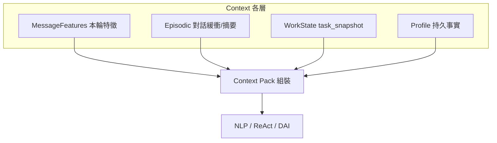
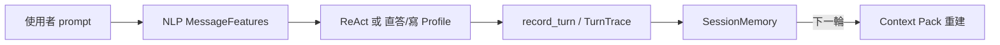

# Context 分層

> 狀態：設計定案  
> 最後更新：2026-09-01  
> 相關：[MessageFeatures-欄位規劃.md](./MessageFeatures-欄位規劃.md)、[UserProfile-欄位規劃.md](./UserProfile-欄位規劃.md)

## 核心觀點

**Profile 是 Context 的一種**——跨輪次、持久化的**事實型 Context**；不是與 Context 平行的另一套系統。

Agent 每輪看到的「上下文」由多層組裝；**Context Pack** 是給 LLM 的**讀取視圖**，Profile 是其中**可持久化**的那一層。

---

## 四層對照

| 層 | 生命週期 | 內容 | 模組 | 誰寫 |
|----|----------|------|------|------|
| **L0 MessageFeatures** | 單輪 | 意圖、正文、關係、capabilities | `message_features.py` | NLP |
| **L1 Episodic** | Session（可壓摘要） | 近几輪對話、rolling_summary | `context_layer` | 每輪 record_turn |
| **L2 WorkState** | Session（跨輪任務） | 上次送審分數、artifact hash、pending | `task_snapshot` | 送審/執行後 |
| **L3 Profile** | **跨 Session** | 名稱、年齡、職位、**relations**、常用 APP | `profile_store` | App 設定 + 對話寫入 |

**Context Pack** = 依本輪需要，從 L1～L3 **選取切片** 串成 prompt（`memory_retrieval` 決定是否注入 Profile relations）。

---

## Context Pack 邏輯（保留）

Hybrid 改版 **不刪 Pack**；退役的是 Memory LLM，不是組裝層。

| 模組 | 檔案 | Hybrid 後 |
|------|------|-----------|
| **Retrieve** | `memory_retrieval.py` | ✅ 保留；決定本輪是否注入 L3 relations |
| **Pack episodic** | `context_layer.pack_episodic_context` | ✅ L1 對話緩衝 + rolling_summary + App display_name |
| **Pack factual** | `context_layer.pack_factual_context` | ✅ L3 relations 切片（`relations_filter`） |
| **Pack work state** | `format_work_state_summary` / task_snapshot | ✅ L2 送審追問 |
| **組裝入口** | `build_context_pack_for_turn` | ✅ 每輪 ReAct / NLP 讀取 |

### Retrieve 判斷（現有 → Hybrid）

| 現況觸發 | Hybrid 可改為 |
|----------|----------------|
| `pending_memory_confirm` | ✅ 不變 |
| 句型像 recall / inventory | 優先看 L0 `primary_goal=recall_relation` |
| 寒暄、純送審 | ❌ 不注入 relations（避免洩漏） |

### 誰還需要 Context Pack

| 路由 | 是否 Pack |
|------|-----------|
| `recall_relation` 查表直答 | **可不 Pack**（直接讀 L3 sqlite） |
| `review_sms` / `follow_up_review` | **要 Pack**（ReAct + DAI 需 L1+L2+L3） |
| NLP MessageFeatures | 可帶 **精簡 Pack**（L2 pending + L3 persona 四欄） |

L0 MessageFeatures **不取代** Pack：L0 是結構化特徵；Pack 是給 LLM 的自然語言／摘要視圖，兩者並用。

---

## Profile 在 Context 裡的角色

| 問題 | 哪層回答 |
|------|----------|
| 使用者這句想幹嘛？ | L0 MessageFeatures |
| 上一輪送審結果？ | L2 WorkState |
| 最近聊過什麼？ | L1 Episodic |
| **媽媽叫什麼？／使用者幾歲？** | **L3 Profile** |

「媽媽是誰」→ NLP（L0）判 `recall_relation` + `relation_label` → **查 L3** → 模板回答。  
不必再開 Memory LLM；Profile **就是**長期記憶的存儲形態。

---

## 寫入 vs 讀取

| 操作 | 路徑 |
|------|------|
| **讀** Profile | Context Pack 注入；或 `recall_relation` 直接查表 |
| **寫** Profile relations | NLP 抽出 label+name → 確認 FSM → `profile_store` |
| **寫** 名稱/年齡/職位/APP | **僅 App 設定**（L3 其他欄） |

---

## 與舊名詞對照

| 舊說法 | 新說法（Context 分層） |
|--------|------------------------|
| Memory 模組 | Profile **寫入 handler** + 可選 skill |
| user_facts | Session 內 Profile relations 快取（同步 L3） |
| Memory LLM | **退役**；意圖在 L0 NLP |
| Context Pack | L1+L2+L3 的組裝視圖 |

---

## 每輪 Session 寫入（Hybrid 定案）

每一輪結束後，Session 應累積 **本輪完整軌跡**，供下一輪 Pack 重建。理想組成：

| 區塊 | 內容 | 來源 |
|------|------|------|
| **使用者本輪** | `user_text`（raw prompt） | API 輸入 |
| **L0 特徵** | `MessageFeatures` JSON | NLP 輸出 |
| **執行軌跡** | ReAct `thought` / `action` / `observation`（或 recall 直答、Profile 寫入） | ReAct / 確定性 handler |
| **對外回覆** | `assistant_text` | 最終 answer |
| **L2 快照** | `task_snapshot` 更新 | 送審／waiting 等 |
| **L3 變更** | Profile `relations` 若有寫入 | 確認 FSM |

### 現況 vs Hybrid

| 項目 | 現況 `ConversationTurn` | Hybrid 目標 |
|------|-------------------------|-------------|
| user / assistant | ✅ | ✅ |
| plan_summary / result_summary | ✅ 簡要 | 可含 MessageFeatures 摘要 + skill 列表 |
| MessageFeatures 全量 | ❌ | ✅ 寫入 turn 或 TurnTrace |
| ReAct 逐步 trace | ❌ | ✅ TurnTrace（H2）；Pack 用摘要 |
| NLP 輸出 | ❌ | ✅ 下一輪 Pack 可帶 L0 摘要 |

**下一輪 Context Pack** = 從 **累積後的 Session** 重建，不是複製上一輪 Pack 字串；但內容上包含「上一輪及更早」的 user、assistant、snapshot、Profile。

### 寫入時機

1. **輪中**：`task_snapshot`、`pending_*`、`user_facts` 即時更新  
2. **輪末**：`record_turn()` append `recent_buffer`；超長則壓入 `rolling_summary`  
3. **H2**：`TurnTrace` 供反饋；可選精簡欄位併入 `ConversationTurn.result_summary`

---

## 變更紀錄

| 日期 | 說明 |
|------|------|
| 2026-09-01 | 初版：Profile 定義為 L3 持久事實 Context |
| 2026-09-01 | 明確：Context Pack / memory_retrieval 邏輯保留；僅 Memory LLM 退役 |
