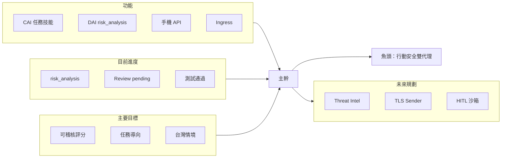
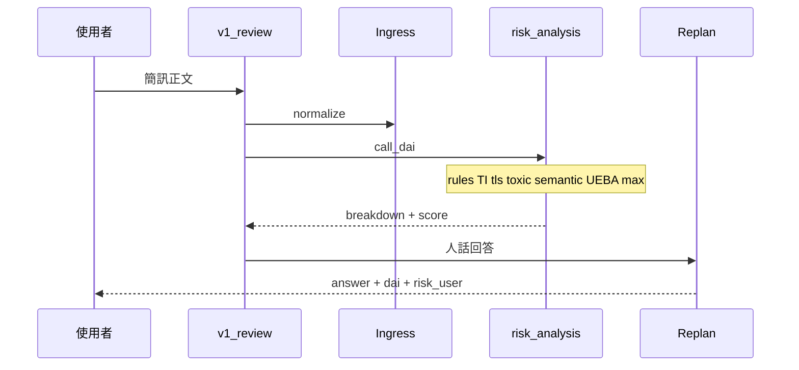

# Dual-agent 專案魚骨圖

本文件整理 Dual-agent（CAI + DAI）專案的四個維度：**主要目標**、**目前進度**、**功能**、**未來規劃**。魚頭為產品主成果；主幹向左分出四條大骨。

> 相關文件：[MOBILE.md](../MOBILE.md)、[Prompt _ Track A.txt](../Prompt%20_%20Track%20A.txt)、[Agent Skills Added.md](../Agent%20Skills%20Added.md)、[SKILLS_MATRIX.md](./SKILLS_MATRIX.md)

---

## 一頁總覽（簡報用 ASCII）

```
                    ┌─ 台灣化可稽核評分
                    ├─ 任務導向 CAI（非閒聊）
    【主要目標】────┼─ LLM 補語意、不當老大
                    └─ 送審／追問雙軌

    【功能】──────────┬──────────【魚頭】
    CAI 技能+Planner  │   行動安全雙代理
    DAI risk_analysis │   簡訊審查可信分數
    Mobile API/UEBA   │   + 任務導向助理

                    ┌─ risk_analysis 已落地
    【目前進度】────┼─ Review/pending 已修
                    ├─ 測試 109+ passed
                    └─ TI/TLS 仍占位

                    ┌─ Threat Intel + TLS + Sender
    【未來規劃】────┼─ Skill 矩陣 + 文件同步
                    └─ HITL / 沙箱 / 稽核（中長期）
```

---

## 魚頭（主成果）

**打造台灣情境下的行動安全雙代理（CAI + DAI）**：使用者可送審簡訊／可疑內容取得**可解釋的風險分與建議**，並以任務導向方式追問、搜尋、開連結；分數由**機器證據為主、LLM 補語意**，避免模型從頭瞎猜。

---

## 主骨一：主要目標

| 子項 | 說明 |
|------|------|
| **可稽核評分** | 分項計分（`r_rules`、`r_threat_intel`、`r_tls`、`r_toxic_fused`、`r_llm_optional`），`r_final = max(...)`，每項需有證據或 `missing_evidence` |
| **台灣化威脅模型** | 對齊 Track A：支付 App、身分證、詐騙話術框架、Tier 護欄 |
| **LLM 非老大** | 語意層只補 H/I 與人話；無 Threat Intel／TLS／Sender 資料則不加分、不捏造 |
| **任務導向 CAI** | 非閒聊機器人；Planner + Replan，Ingress 區分審查／搜尋／direct_response |
| **雙軌使用者體驗** | 送審快徑（`POST /v1/review`）；一般對話走完整 CAI（`POST /v1/chat`） |
| **UEBA 不洗掉高風險** | 信任網域／來源可調分，但 `r_rules`／`r_threat_intel` ≥85 時有底線保護 |

---

## 主骨二：目前進度

| 子項 | 狀態 | 說明 |
|------|------|------|
| **DAI risk_analysis 管線** | 已實作 | `dual_agent/dai/risk_analysis/`，`guard_pipeline` 委派 |
| **簡訊送審路徑** | 已切換 | `invoke_dai(sms_review)` → `run_risk_analysis` |
| **結構化 breakdown** | 已輸出 | `component_scores`、`track_a`、`verdict`、`dominant_source` |
| **Review Entry / pending** | 已上線 | 宣告收到簡訊 → ask_user；補正文 → 可 `call_dai` |
| **手機 API** | 可跑 | `mobile_server.py` + Android smsagent |
| **硬規則 + Toxic + UEBA** | 已接通 | `rules.py`、`toxic_score.py`、`user_db` |
| **Threat Intel / TLS** | 占位 | 可列 `missing_evidence`；需 API 或注入 |
| **語意 LLM（H/I）** | 可開關 | 環境變數 `DAI_SEMANTIC_LLM=0` 可關閉 |
| **測試** | 通過 | 含 `tests/test_risk_analysis.py` |
| **Skill 目錄對表** | 已產出 | 見 [SKILLS_MATRIX.md](./SKILLS_MATRIX.md) |

---

## 主骨三：功能（現有能力地圖）

### CAI（Helpful）— 已註冊技能

| 功能 | 用途 |
|------|------|
| `search_web` | 網路搜尋 |
| `fetch_url` | 讀取已知 URL |
| `instant_answer` | 短條目快答 |
| `weather` | 天氣查詢 |
| `ask_user` | 向使用者要資料（含待審正文） |
| `call_dai` | 觸發 DAI 風險分析 |
| `open_url_readonly` / `open_app` | 開瀏覽器／本機 App |
| `confirm` | 確認類互動 |

**流程能力（非單一 skill）**：Ingress 正規化、Context Pack、Planner、Executor、Replan、多輪 `pending_review`。

### DAI（Protective）— 管線與技能

| 功能 | 用途 |
|------|------|
| `run_risk_analysis` | 主評分管線（機器層 + 語意 + UEBA） |
| `run_guard_pipeline` | 同上（向後相容別名） |
| `run_guard_pipeline`（skill） | 獨立呼叫完整報告 |
| UEBA `user_db` | 來源／信任網域、`risk_user` |
| Toxic DB / Chroma | `r_toxic_fused` |

### 對外介面

| 功能 | 說明 |
|------|------|
| `POST /v1/review` | 送審：Ingress → `call_dai` → Replan → 風險卡欄位 |
| `POST /v1/chat` | 追問：完整 Planner 迴路 |
| `/v1/trust/domains` | 信任／封鎖網域管理 |
| `desktop_cai_app.py` | 桌面版（Planner 路徑） |

### 組員文件中的規劃中功能

見 [Agent Skills Added.md](../Agent%20Skills%20Added.md) 與 [SKILLS_MATRIX.md](./SKILLS_MATRIX.md)（狀態：規劃中）。

---

## 主骨四：未來規劃

### 近期（優先）

1. **Threat Intel 接入**：`url_threat_hits`（VT / 165 / blocklist）
2. **TLS 探測**：`DAI_TLS_PROBE=1` + 輕量憑證檢查
3. **Sender 脈絡**：`ReviewBody` / `DAIRequest` 帶 `sender_tech_context`
4. **App 風險卡**：展開 `track_a.breakdown`、`component_scores`

### 中期（工程項）

| 項目 | 目的 |
|------|------|
| 骨架技能接真 LLM | mock／regex 技能改接 Ollama |
| Human-in-the-Loop | 高風險 skill 需 UI 確認 |
| Shell 沙箱 | 若做 `execute_shell`，放 Docker |
| 稽核防竄改 | audit log 加密／唯追加寫入 |

### 長期

- 插件化 skill、持續學習（文件 Advanced Features）
- 統一監控與文件（完全淘汰舊 Defense 主評分敘事）

---

## 架構圖（Mermaid）



---

## 送審主路徑（附錄）



---

## 評分公式（DAI，摘要）

```
r_final = max(r_rules, r_threat_intel, r_tls, r_toxic_fused, r_llm_optional)
→ UEBA 調整（高惡意證據不得被完全洗掉）
→ verdict: ≥85 block / 70–84 warn / <70 allow
```

詳見 `dual_agent/dai/risk_analysis/pipeline.py` 與 [Prompt _ Track A.txt](../Prompt%20_%20Track%20A.txt)。
