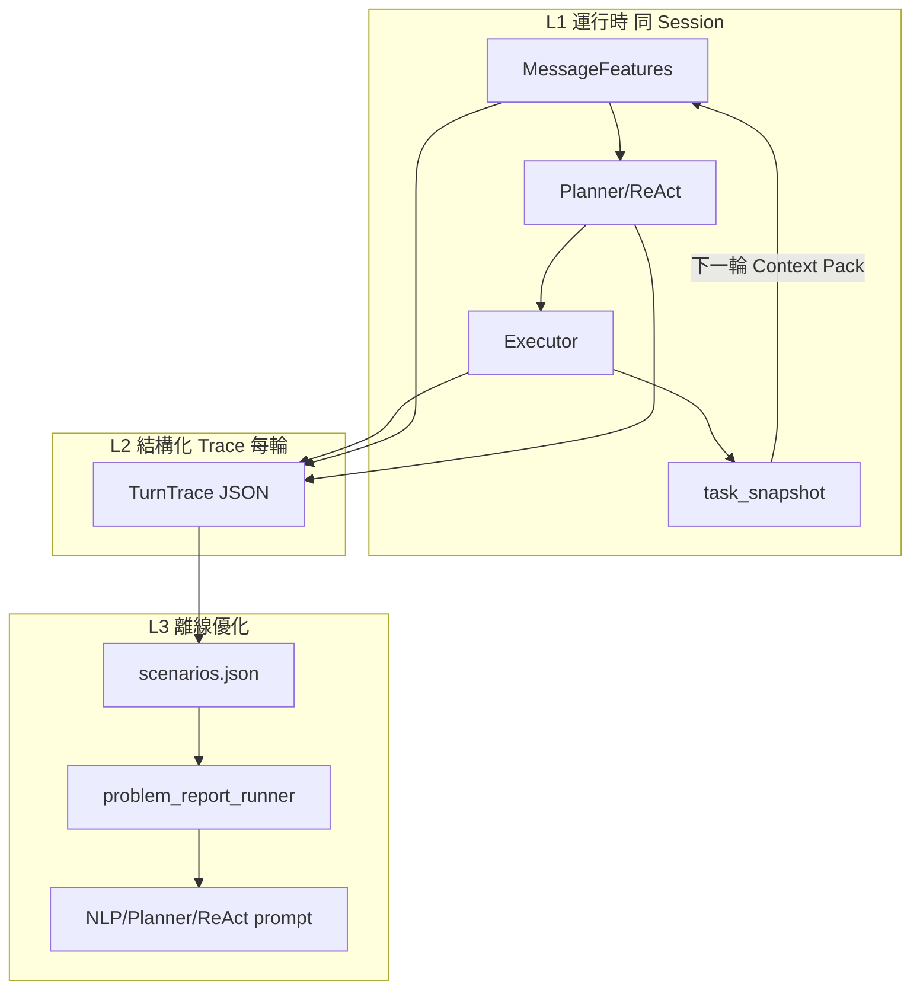

# Hybrid 反饋與優化

> 狀態：設計定案（待實作 H2）  
> 最後更新：2026-09-01  
> 對應模組（規劃）：`dual_agent/cai/hybrid/feedback.py`  
> 相關文件：[MessageFeatures-欄位規劃.md](./MessageFeatures-欄位規劃.md)、[VERIFICATION_WORKFLOW.md](./VERIFICATION_WORKFLOW.md)

## 定位

Hybrid 管線**第 5 階：全局反饋**。目標不是線上自動訓練模型，而是：

1. **運行時**：把本輪結果寫入 `task_snapshot`，供下一輪 NLP / Planner 讀取  
2. **離線**：用 `TurnTrace` + `scenarios.json` 定位誤排，迭代 **NLP few-shot / Planner / ReAct prompt**  
3. **分軌**：詐騙 ML 在獨立 `ml` repo，**不**混入 CAI 路由優化

```
本輪執行 → TurnTrace + task_snapshot → scenarios 回歸 → 人工改 prompt → 再測
```

---

## 三層反饋架構



| 層級 | 時機 | 產物 | 優化對象 |
|------|------|------|----------|
| L1 運行時 | 每輪結束 | `task_snapshot` | 下一輪 `is_follow_up`、`follow_up_review` |
| L2 Trace | 每輪結束 | `TurnTrace` | mismatch 分類 → 改哪一層 |
| L3 離線 | CI / 手動 | scenarios pass/fail | few-shot、prompt、場景庫 |

---

## L1：`task_snapshot`（已有，擴充）

現有：`context_layer.record_turn` / `record_turn_after_review`。

### 現有欄位（送審後）

| 欄位 | 說明 |
|------|------|
| `task_type` | 如 `review_sms` |
| `task_state` | 如 `completed` |
| `last_risk_score` | DAI 風險分 |
| `last_artifact_hash` | 正文 hash |
| `last_dai_summary` | 結果摘要 |

### H2 擴充（規劃）

| 欄位 | 說明 |
|------|------|
| `last_message_features` | 上一輪 NLP 特徵摘要（或 hash） |
| `last_capabilities` | 上一輪 `domain_tags` |
| `last_planned_skill` | 如 `call_dai` |
| `pending_review` | 是否等正文 |

**用途**：下一輪 NLP 讀 Context Pack 時判斷 `is_follow_up`、`follow_up_review`，不需 regex。

---

## L2：`TurnTrace` schema

每輪管線結束寫入一筆 Trace（可 append 到 session 或 `test_reports` 審計 JSON）。

### 頂層

| 欄位 | 型別 | 說明 |
|------|------|------|
| `trace_id` | string | UUID |
| `session_id` | string | |
| `turn_index` | int | 輪次 |
| `timestamp` | string | ISO8601 |
| `input_origin` | string | `chat_box` / `sms_share` / `api_review` |
| `user_text` | string | 原始輸入（可截斷存檔） |
| `message_features` | object | 完整 [MessageFeatures](./MessageFeatures-欄位規劃.md) |
| `routing` | object | 路由決策，見下 |
| `execution` | object | 執行結果，見下 |
| `outcome` | object | 對使用者可見結果，見下 |
| `mismatch` | object? | 若與 scenarios 或預期不一致 |

### `routing`

| 欄位 | 型別 | 說明 |
|------|------|------|
| `path` | enum | `memory_shortcut` \| `planner` \| `react` \| `decline` |
| `pattern_id` | string? | 如 `P_REVIEW`（若保留 pattern_router） |
| `planned_skills` | string[] | 如 `["call_dai"]` |
| `react_steps` | int | ReAct 步數 |

### `execution`

| 欄位 | 型別 | 說明 |
|------|------|------|
| `skills_invoked` | string[] | 實際呼叫的 skill |
| `executor_status` | enum | `ok` \| `blocked` \| `meta_only` \| `error` |
| `dai_risk_score` | number? | |
| `error_code` | string? | |

### `outcome`

| 欄位 | 型別 | 說明 |
|------|------|------|
| `assistant_text` | string | 回覆摘要 |
| `task_state` | string | 寫入 snapshot 的 state |
| `user_visible_action` | enum | `review_result` \| `ask_user` \| `decline` \| `memory_confirm` |

### `mismatch`（離線或 assert 時填入）

| 欄位 | 型別 | 說明 |
|------|------|------|
| `layer` | enum | `nlp` \| `planner` \| `react` \| `executor` \| `memory` |
| `expected_domain_tags` | string[] | 來自 scenarios |
| `actual_domain_tags` | string[] | 來自 MessageFeatures |
| `expected_skill` | string? | |
| `actual_skill` | string? | |
| `severity` | enum | `critical` \| `warn` \| `info` |

### JSON 範例

```json
{
  "trace_id": "tr-001",
  "session_id": "sess-abc",
  "turn_index": 1,
  "timestamp": "2026-09-01T14:00:00+08:00",
  "input_origin": "chat_box",
  "user_text": "我媽收到這則，幫我看是不是詐騙：【台新…】",
  "message_features": {
    "turn_intent": { "primary_goal": "review_sms", "is_follow_up": false, "confidence": 0.92 },
    "capabilities": {
      "required_types": ["tool_call"],
      "domain_tags": ["safety_review"],
      "suggested_skills": ["call_dai"],
      "is_multi_step": false
    }
  },
  "routing": {
    "path": "react",
    "pattern_id": "P_REVIEW",
    "planned_skills": ["call_dai"],
    "react_steps": 2
  },
  "execution": {
    "skills_invoked": ["call_dai"],
    "executor_status": "ok",
    "dai_risk_score": 78
  },
  "outcome": {
    "assistant_text": "此則簡訊風險偏高…",
    "task_state": "completed",
    "user_visible_action": "review_result"
  }
}
```

---

## mismatch 分類 → 改哪一層

| 現象 | `mismatch.layer` | 優化動作 |
|------|------------------|----------|
| 閒聊卻標 `safety_review` / `tool_call` | `nlp` | 加 NLP few-shot（out_of_scope 反例） |
| 特徵對但 Planner 排錯 skill | `planner` | 改 Planner prompt / 加 capabilities 對照表 |
| Planner 對但 ReAct 多步亂跑 | `react` | 改 ReAct prompt、限步數 |
| 排了 `call_dai` 但 Executor 擋（無正文） | `executor` 或 `nlp` | 查 `has_reviewable_body` 是否抽錯 |
| remember 沒寫入 relations | `memory` | Memory LLM few-shot |

**原則**：特徵錯 → 改 NLP；特徵對行為錯 → 改 Planner/ReAct；**不加 regex 護欄**。

---

## L3：scenarios 與現有工具鏈

### 沿用

| 工具 | 路徑 | 用途 |
|------|------|------|
| 問題劇本 | `test_reports/<問題>/scenarios.json` | baseline / experimental / control |
| 審計 | `scripts/problem_report_runner.py` | 不需 Ollama 的規則審計 |
| 對話重現 | `scripts/run_test_dialogue.py` | 含 Ollama 的 E2E |
| 流程說明 | [VERIFICATION_WORKFLOW.md](./VERIFICATION_WORKFLOW.md) | 循環驗證 |

### H2 新增 scenario 類型（規劃）

| type | 斷言對象 |
|------|----------|
| `message_features` | NLP 輸出 `primary_goal`、`capabilities.domain_tags` |
| `hybrid_routing` | Trace 層級：`routing.path`、`planned_skills` |
| `turn_trace` | 端到端 TurnTrace 欄位 |

#### `message_features` scenario 範例

```json
{
  "id": "chat_riddle_no_dai",
  "type": "message_features",
  "turns": [
    {
      "user": "做 it 有很多方面，你猜是哪個方面的",
      "expect": {
        "primary_goal": "out_of_scope",
        "capabilities.domain_tags": ["out_of_scope"],
        "capabilities.required_types": ["direct_response"],
        "must_not_invoke": ["call_dai"]
      }
    }
  ]
}
```

### 回歸基線

- 擴充 [`test_reports/agent_full_coverage/`](../test_reports/agent_full_coverage/) 對齊五階段 + MessageFeatures 預期  
- 與問題導向劇本（如 `pending_review_無法取消`）並存

---

## 優化迭代流程（人工）

1. **發現**：Demo / 對話 / scenarios fail  
2. **定位**：看 `TurnTrace.mismatch.layer`  
3. **修**：對應層改 prompt 或 few-shot（不寫 regex）  
4. **驗**：`run_problem_reports_audit.py` + `run_test_dialogue.py`  
5. **收斂**：`scenarios.json` → `status: fixed`，commit  

### Demo 手動標記（可選）

App / 桌面除錯面板可標：

- `misroute_call_dai`  
- `missed_ask_user`  
- `wrong_capabilities`  

標記寫入 `test_reports/<問題>/` 草稿 scenario，進入上述循環。

---

## 刻意不做（MVP）

| 項目 | 原因 |
|------|------|
| 線上 RL / 自動 fine-tune Ollama | 成本高、難除錯 |
| 自動改程式碼 | 人工審核 prompt 即可 |
| 用戶 thumbs up/down 閉環 | 可 Phase H3+ 再加 |
| 詐騙 ML 權重自動調 | 走 `ml` repo Track B |

---

## 實作順序（Phase H2）

1. `cai/hybrid/feedback.py`：`TurnTrace` Pydantic、`record_turn_trace()`  
2. `plan_execute` 管線末尾 hook：寫 Trace + 擴充 snapshot  
3. `problem_report_runner` 新增 `message_features` / `hybrid_routing` type  
4. 重寫 `agent_full_coverage/scenarios.json`  
5. Mobile pipeline 節點對齊：`parse` → `route` → `react_*` → `fuse` → `feedback`

---

## 變更紀錄

| 日期 | 說明 |
|------|------|
| 2026-09-01 | 初版：三層反饋、TurnTrace schema、mismatch 分類、scenarios 擴充 |
