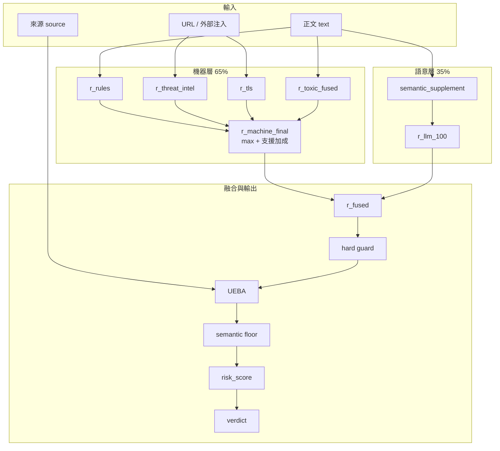

# DAI 風險評分公式與說明

本文件說明 ScamSentinel 系統中 **DAI（Defense Agent Intelligence）** 如何對簡訊、通知、連結等內容計算風險，以及如何產出判定與使用者可讀風險卡。

> **現行主路徑（2026-08 硬取代）**：`SMS_REVIEW_DAG = ("dual_path_analyze",)`  
> 引擎：`dual_agent/dai/fraud_dual`（桌面 ML 雙路）＋適配層 `risk_analysis/dual_path.py`。  
> - Path A：`threat_score` + `context_score`（**禁止數值融合**；並列輸出）  
> - Path B：純 LLM（不讀 Path A 分數；失敗則略過）  
> - Narrator：解釋 Path A（同一組 DAI Ollama）  
> - CAI 相容門檻：`risk_score = max(threat, context) * 100` → `verdict` / `recommended_cai_action`
>
> **舊規則／權重／銀行 LR 融合**：模組仍保留於 `risk_analysis/`（離線訓練／單元測試），**不再**作為 `run_sms_review_dag` 產品主路徑。見下文「附錄：舊融合公式」。
>
> 相關程式：`dual_agent/dai/skills/_pipeline_steps.py`（`step_dual_path_analyze`）、`dual_agent/dai/fraud_dual/`  
> 相關文件：[FISHBONE.md](./FISHBONE.md)

---

## 0. 雙路主路徑（產品）

```
dual_path_analyze
  → extract_shared + predict_threat + score_context → Result_A
  → (可選) Path B Ollama → Result_B
  → (可選) Narrator
  → report.path_a / path_b + gate risk_score
```

| 欄位 | 說明 |
|------|------|
| `path_a.threat_score_100` | Threat 0–100 |
| `path_a.context_score_100` | Context 0–100 |
| `path_a.reasons` / `warnings` | Path A 原因與警示 |
| `path_b.*` | Path B 對照（或 `skipped`） |
| `risk_score` | `max(threat, context)`，僅供 CAI 動作門檻 |

建圖欄位（persona）：

| 欄位 | 來源 |
|------|------|
| `age_band` / `occupation` / `primary_apps` / `invest_exp` | 本機 `data/user_profile.sqlite`（對話／設定寫入） |
| `channel` | 系統推斷（可參照 `primary_apps`） |
| `relation_type` | 系統推斷；優先命中 Memory／sqlite `relations` 人名（如小明＝兒子 → Family） |

`known_relations` 經 `sender_tech_context` 傳入雙路推斷。環境變數同前（`DAI_DUAL_INFER_*`）。CAI 防詐敘事不再被 Memory 捷徑攔截（階段1）。

環境變數：`DAI_DUAL_PATH_B`（預設開）、`DAI_DUAL_NARRATOR`（預設開）。  
Context 後端：`DAI_CONTEXT_BACKEND`＝`auto`（預設，**GNN → HistGBDT → 規則**）／`hetero`／`learned`／`rules`。權重優先 `DAI_HETERO_MODEL_PATH`，否則 `data/fraud_dual_models/context_hetero_ranking_full.pt`，否則 `context_hetero.pt`。`path_a.context_backend` 回報實際後端。

### 後續計畫：依常用 App 擴充 `channel` 節點（未開工）

**現況（不得跳過重訓硬擴）**

- `channel`／`primary_apps` 皆綁封閉詞表 `CHANNELS`：`LINE`、`Telegram`、`SMS`、`Email`、`Facebook`、`Website`（見 `fraud_dual/shared/constants.py`、`schemas.py`）。
- Path A GNN 的 channel 節點為對該詞表的 one-hot（+ familiar 旗標）；**維度與權重綁死已訓練模型**。
- 常用 App 今日角色僅為：推斷本則 `channel` 的先驗、計算 `channel_is_familiar`（`channel in primary_apps`），**不是**動態新增節點類型。

**目標**

- 讓「常用 App」可對應／擴充到更貼近真實通訊生態的 channel（例如 WhatsApp、Instagram、Discord 等），並保持 Path A 分數可比與可重訓。

**建議階段**

| 階段 | 內容 | 產物／通過條件 |
|------|------|----------------|
| **P0 對照表（低風險）** | App 套件／顯示名 → 既有六種 `CHANNELS` 的映射表（Android 挑選＋後端 `_normalize_apps` 別名）；未對應者本機可記、不進圖 | 挑選 LINE／Messages 可穩定產出 `LINE`／`SMS`；familiar 行為正確 |
| **P1 詞表擴充設計** | 選定要新增的 channel 清單、先驗風險 `CHANNEL_PRIOR_RISK`、與訓練標註規則；決定 one-hot 維度變更策略 | RFC：新詞表＋相容舊 checkpoint 的策略（重訓／寬填充） |
| **P2 資料＋重訓** | 標註／合成資料含新 channel；重訓 Threat／Context；更新 `fraud_dual_models` | 驗證集指標不劣於舊模型；schema 與推斷 LLM prompt 同步 |
| **P3 產品接线** | 推斷 `infer_message_channel`、桌面／手機 profile、風險卡文案、`RISK_SCORING`／`MOBILE` 文件 | E2E：常用 App 含新管道時熟悉度與推斷合理 |

**明确不做（此計畫範圍外）**

- 不把任意已安裝 App 的 packageName 直接當成 GNN channel 類別（稀疏爆炸、無法泛化）。
- 不在未重訓情況下硬改 `CHANNELS` 長度載入舊權重。

**觸發時機**：雙路徑穩定、App 挑選與 profile 同步上線後，再啟動 P1。

---

## 附錄：舊融合公式（已非主路徑）

> 以下為硬取代前的規則＋權重／ml_lr 說明，供對照與離線研究。

---

## 1. 設計原則（舊）

| 原則 | 說明 |
|------|------|
| **機器證據為主** | 硬規則、威脅情資、TLS、毒樣庫等可稽核訊號為主要依據 |
| **LLM 非主評分** | 語意層只補台灣詐騙框架（H）與語言品質（I），不得改寫或重算機器分項 |
| **缺資料不加分** | 無 Threat Intel、TLS、Sender 等外部證據時，不捏造、不猜測 |
| **可稽核 breakdown** | 全程輸出 `component_scores`、`evidence`、`track_a`，供事後檢視 |
| **高惡意底線保護** | `r_rules` 或 `r_threat_intel` ≥ 85 時，融合分與 UEBA 不得把分數洗低 |

融合模式：`risk_fusion.mode = machine_support_bonus_weighted`（融合 v2）。

---

## 2. 評分管線（舊 7 步 DAG）

送審（`sms_review`）時，舊版 DAI 依固定順序執行下列 skills：

```
build_analysis_payload
  → score_rules
  → score_threat_intel
  → score_tls
  → score_toxic
  → semantic_supplement
  → fuse_risk_and_ueba
```

| 步驟 | 程式 / Skill | 產出 |
|------|----------------|------|
| 1 | `build_analysis_payload` | 正文、URL、`url_threat_hits`、`tls_findings` |
| 2 | `score_rules` | `r_rules` |
| 3 | `score_threat_intel` | `r_threat_intel` |
| 4 | `score_tls` | `r_tls`、`missing_evidence` |
| 5 | `score_toxic` | `r_toxic_fused` |
| 6 | `semantic_supplement` | `r_llm_optional`、`tier_h`、`tier_i`、`labels` |
| 7 | `fuse_risk_and_ueba` | 最終 `risk_score`、`verdict`、風險卡欄位 |

CAI 透過 `call_dai` 觸發上述管線；對使用者只展示**單一** `risk_score`，不得自創第二套分數。

---

## 3. 分項計分（component_scores）

五個主要維度各自計分（0–100），記錄於 `component_scores`。各維度內部通常取**命中規則的最高分**，分項之間在融合前**不加總**。

### 3.1 `r_rules` — 硬規則（Tier 1）

來源：`dual_agent/dai/risk_analysis/rules.py`  
方法：正則比對台灣情境關鍵字／話術。

| 檔位 | 分數 | 規則 ID（範例） | 觸發條件（摘要） |
|------|------|-----------------|------------------|
| Tier 90 | 90 | `password_credentials` | 要求密碼、帳密 |
| Tier 90 | 90 | `otp` | 驗證碼、OTP、動態密碼 |
| Tier 90 | 90 | `card_bank_sensitive` | 信用卡、金融卡、匯款帳號等 |
| Tier 90 | 90 | `national_id_ubn` | 身分證、統編 |
| Tier 90 | 90 | `local_payment_pin` | LINE Pay、街口、全支付等 PIN |
| Tier 90 | 90 | `payment_ransom_threat` | 匯款、贖金、威脅付款 |
| Tier 90 | 90 | `physical_threat` | 人身安全威脅 |
| Tier 60 | 60 | `high_risk_combo_link_account_urgent` | **連結 + 帳戶異常 + 急迫驗證** 同時出現 |
| Tier 25 | 25 | `loan_scam` | 借款、免擔保、月計息等 |
| Tier 25 | 25 | `nh_card_loan` | 健保卡借款 |
| Tier 25 | 25 | `unsolicited_loan_pitch` | 主動推銷貸款 + 手機聯絡 |
| Tier 25 | 25 | `identity_scam_framework` | 實名認證、政府補助、物流異常 |
| Tier 25 | 25 | `low_finance_notify` | 金融／帳戶／驗證／補助等通知用語 |

**公式：**

```
r_rules = clamp( max( 各命中規則的 points ), 0, 100 )
```

---

### 3.2 `r_threat_intel` — URL 威脅情資

來源：`dual_agent/dai/risk_analysis/providers.py`  
僅使用系統提供的 `url_threat_hits`（VirusTotal、PhishTank、165、電信 blocklist 等），**無資料則 0 分**。

| 條件 | 分數 |
|------|------|
| vendor_count ≥ 5 且 label 為 phishing / malware | 40 |
| vendor_count ≥ 4 | 35 |
| vendor_count ≥ 2 | 25 |
| vendor_count = 1 | 15 |
| 無命中 | 0 |

**公式：**

```
r_threat_intel = max( 各 URL 依上表計分, 0 )，上限 100
```

> 現況多為占位（`label: unknown`）；需接入 Threat Intel API 或注入 `URL_THREAT_HITS_JSON` 才會生效。

---

### 3.3 `r_tls` — TLS 憑證異常

來源：`dual_agent/dai/risk_analysis/providers.py`  
預設不主動探測；需 `DAI_TLS_PROBE=1` 或注入 `tls_findings`。

| 異常 | 分數 |
|------|------|
| 自簽憑證（`self_signed`） | 15 |
| 網域不符（`domain_mismatch`） | 15 |
| 憑證過期（`expired`） | 10 |
| 非 HTTPS（`https: false`） | 5 |

**公式：**

```
r_tls = max( 各 URL 異常分, 0 )，上限 100
```

---

### 3.4 `r_toxic_fused` — 毒樣資料庫相似度

來源：`dual_agent/dai/risk_analysis/toxic_score.py`  
比對 Chroma 向量庫或 JSON 毒樣庫，以 cosine 相似度映射為 0–100。

環境變數：

- `TOXIC_CHROMA_PERSIST_DIR` + `TOXIC_CHROMA_COLLECTION`
- 或 `TOXIC_DB_PATH`

未設定毒樣庫時，`r_toxic_fused = 0`（mode: `disabled`）。

---

### 3.5 `r_llm_optional` — 語意補充層

來源：`dual_agent/dai/risk_analysis/semantic_llm.py`  
LLM **不得**改寫 `r_rules`、`r_threat_intel`、`r_tls`、`r_toxic_fused`。

| 輸出 | 範圍 | 說明 |
|------|------|------|
| `tier_h` | 0–20 | 台灣詐騙框架（政府補助、物流、銀行異常等） |
| `tier_i` | 0–12 | 繁簡混用、錯字群聚 |
| `r_llm_optional` | 0–32 | 語意加分上限（通常 ≤ tier_h + tier_i） |
| `labels` | 字串列表 | 如 `phishing`、`credential_harvesting` |
| `safety_summary` | 文字 | 繁體中文安全摘要 |

**護欄：**

- 若 Tier1/2 機器分皆低，且正文**僅緊急語氣**（無 URL／密碼／OTP 等）：`tier_h`、`tier_i`、`r_llm_optional` 皆 ≤ 5
- 關閉語意層：`DAI_SEMANTIC_LLM=0`

**映射至 0–100（供融合用）：**

```
raw = max( r_llm_optional, tier_h + tier_i )
raw = clamp( raw, 0, 32 )
r_llm_100 = round( raw × 100 / 32 )    # 若 raw = 0 則 r_llm_100 = 0
```

---

## 4. 融合公式 v2（machine_support_bonus_weighted）

來源：`dual_agent/dai/risk_analysis/verdict.py` → `fuse_risk_score_weighted()`

### 4.1 機器層聚合

取四個機器分項，排序後計算支援加成：

```
scores = sort_desc( r_rules, r_threat_intel, r_tls, r_toxic_fused )

r_machine_base          = scores[0]                              # 最高分
r_machine_support_bonus = round( 0.15 × scores[1] + 0.10 × scores[2] )
r_machine_final         = clamp( r_machine_base + r_machine_support_bonus, 0, 100 )
```

### 4.2 加權融合

```
w_llm     = DAI_R_LLM_WEIGHT          # 預設 0.35，環境變數可調
w_machine = 1 - w_llm                 # 預設 0.65

r_fused = round( w_machine × r_machine_final + w_llm × r_llm_100 )
r_fused = clamp( r_fused, 0, 100 )
```

### 4.3 硬護欄（hard guard）

```
hard = max( r_rules, r_threat_intel )

若 hard ≥ 85：
    r_fused = max( r_fused, hard )

若 r_machine_final ≥ 50 且 hard < 85：
    floor = round( r_machine_final × 0.85 )
    r_fused = max( r_fused, floor )
```

`hard_guard_applied` 記錄是否觸發上述護欄。

---

## 5. UEBA 使用者行為調整

來源：`dual_agent/dai/user_db.py` → `compute_user_risk()`、`apply_ueba_adjustment()`

依**來源信任度**、**是否首次見過**、**訊息內 URL 網域**等計算 `delta_user`，再 clamp 為有效調整量：

```
delta_user_effective：
  正向（可疑）最多 +15
  負向（信任）最多 -8

adjusted = clamp( r_fused + delta_user_effective, 0, 100 )
```

**UEBA 底線保護（不得洗低高惡意）：**

```
若 max(r_rules, r_threat_intel) ≥ 85：
    adjusted = max( adjusted, floor, r_fused )    # floor = max(r_rules, r_threat_intel)

若 r_fused ≥ 85：
    adjusted = max( adjusted, r_fused )
```

---

## 6. 語意標籤下限（semantic floor）

來源：`semantic_floor_from_labels()`  
依 LLM 輸出的 `labels` 設定**顯示分下限**（抬高 `risk_score`，非直接改 verdict 邏輯）：

| 標籤 | 下限 |
|------|------|
| `financial_extortion`、`payment_pressure`、`physical_threat` | 85 |
| `credential_harvesting`、`credential_harvest` | 75 |
| `phishing`、`impersonation` | 60 |
| `malicious_link` | 55 |
| `urgency_pressure` | 40 |
| `suspicious_notification` | 35 |

**公式：**

```
semantic_floor = max( 各命中 label 對應下限 )
risk_score     = max( adjusted, semantic_floor )
```

若 `max(r_rules, r_threat_intel) ≥ 85`，最終分另與硬規則底線對齊：

```
risk_score_total_user_fused = max( risk_score_total_user_fused, max(r_rules, r_threat_intel), r_fused )
risk_score = risk_score_total_user_fused
```

---

## 7. 判定等級（verdict）

```
若 risk_score ≥ 85  →  block   （高風險，建議阻擋）
若 risk_score ≥ 70  →  warn    （中高风险，提高警覺）
否則                →  allow   （分數偏低，仍須留意來路）
```

**建議 CAI 動作（`recommended_cai_action`）：**

| 條件 | 動作 |
|------|------|
| `block` 或 risk_score ≥ 85 | `block` |
| `warn` 或 risk_score ≥ 70 | `ask_user` |
| `r_rules ≥ 25` 或 risk_score ≥ 40 | `ask_user` |
| 其餘 | `continue` |

---

## 8. 完整計分流程（一覽）

```
輸入：正文 text、來源 source、可選 url_threat_hits / tls_findings 注入

① r_rules, r_threat_intel, r_tls, r_toxic_fused     ← 各維度獨立計分
② semantic_supplement → r_llm_optional, labels
③ r_machine_final = max(四項) + 支援加成
④ r_fused = 0.65 × r_machine_final + 0.35 × r_llm_100   （預設權重）
⑤ hard guard 抬高 r_fused
⑥ adjusted = r_fused + UEBA delta（有底線保護）
⑦ risk_score = max( adjusted, semantic_floor )
⑧ verdict = f(risk_score)
⑨ enrich_report_display_fields → display_text（風險卡）
```

---

## 9. 輸出結構（稽核用）

送審完成後，`report` 主要欄位：

| 欄位 | 說明 |
|------|------|
| `risk_score` | 最終顯示分（0–100） |
| `verdict` | `block` / `warn` / `allow` |
| `component_scores` | 各分項與中間值（含 `r_machine_final`、`delta_user` 等） |
| `risk_fusion` | 融合模式、權重、是否觸發 hard guard / UEBA guard |
| `track_a` | `tier_scores`（H/I）、`matched_rules`、`missing_evidence` |
| `evidence` | 規則命中、情資、TLS、毒樣、語意引用 |
| `reason_highlights` | 內部原因摘要（含分數） |
| `user_reason_highlights` | 使用者面向主要原因（人話、不含 DAG 步驟名） |
| `user_suggestions` | 建議動作 |
| `display_text` | App／API 共用風險卡全文 |
| `dominant_source` | 分項中最高分來源鍵名 |

**風險卡格式範例：**

```
風險分數：75/100
判定：warn

主要原因：
• 要求提供驗證碼或一次性密碼
• ...

建議：
• 請提高警覺，建議勿輕信
```

---

## 10. 可調參數與環境變數

| 變數 | 預設 | 說明 |
|------|------|------|
| `DAI_R_LLM_WEIGHT` | `0.35` | 語意層融合權重（機器層 = 1 − 此值） |
| `DAI_SEMANTIC_LLM` | `1` | 設 `0` 關閉語意補充 |
| `DAI_TLS_PROBE` | 關 | 設 `1` 啟用 TLS 探測 |
| `URL_THREAT_HITS_JSON` | — | Threat Intel 注入路徑 |
| `TOXIC_CHROMA_*` / `TOXIC_DB_PATH` | — | 毒樣庫 |
| `USER_DB_PATH` | `user_profile_db.json` | UEBA 使用者 profile |

程式內建常數（`verdict.py`）：

| 常數 | 值 | 說明 |
|------|-----|------|
| 支援加成係數 | 0.15、0.10 | 次高分、第三高分權重 |
| `_LLM_RAW_CAP` | 32 | 語意原始分上限 |
| UEBA 正向 cap | +15 | `delta_user` 有效上限 |
| UEBA 負向 cap | -8 | 信任來源減分下限 |
| hard guard 比例 | 0.85 | `r_machine_final ≥ 50` 時的融合下限 |

> **備註：** 上述參數目前以工程先驗與 Track A 對齊為主，**尚未以大量標註資料做統計校準**。後續可透過離線標定或監督式校準層調整，見團隊內部討論。

---

## 11. 架構圖



---

## 12. 與 CAI 的邊界

- CAI 透過 `call_dai` 取得 DAI 報告；Replan 應**優先複述** `display_text`。
- CAI **禁止**自創 `risk_fusion.r_final`、`component_scores` 或第二套分數。
- 若 observation 中**沒有** DAI 成功送審紀錄，CAI **不得**捏造「xx/100」等審級結論。

---

## 13. 公式速查（單行版）

```
r_rules            = max(命中規則分)
r_machine_final    = max(r_rules,r_ti,r_tls,r_toxic) + round(0.15×次高 + 0.10×第三)
r_fused            = round(0.65×r_machine_final + 0.35×r_llm_100)  [+ hard guard]
adjusted           = r_fused + clamp(delta_user, -8, +15)           [+ UEBA guard]
risk_score         = max(adjusted, semantic_floor)                  [+ 硬規則底線]
verdict            = block(≥85) | warn(≥70) | allow
```
