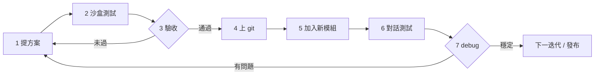

# Dual-agent 驗證工作流

本專案採**循環式**驗證：先在小範圍沙盒證明修正，驗收通過後才進 git；新能力以模組增量加入，再以對話測試與 debug 收斂，再進下一輪方案。

---

## 總覽



| 階段 | 產出物 | 負責 |
|------|--------|------|
| 1 提方案 | 修正計畫、根因、影響範圍 | Cursor / 開發者 |
| 2 沙盒測試 | 程式變更、pytest、mock 審計、對話紀錄 | Cursor（本機） |
| 3 驗收 | 0 fail 審計、對照組通過、回歸綠燈 | 開發者確認 |
| 4 上 git | commit（通過後才提交） | 開發者 |
| 5 新模組 | 功能／skill／腳本增量 | 開發者 |
| 6 對話測試 | `test_dialogue`、可選 Ollama E2E | Cursor / 人工 |
| 7 debug | 問題回報、`scenarios.json`、再修 | 循環回 1 |

---

## 三層資料（全程共用）

| 資料夾 | 用途 |
|--------|------|
| [`test_dialogue/`](../test_dialogue/) | **測試者 ↔ Dual-agent** 的對話紀錄（劇本本體） |
| [`test_reports/`](../test_reports/) | 問題分析、`scenarios.json`、審計 JSON |
| [`docs/`](../docs/) | 工作流、架構、本檔 |

同一問題兩邊**資料夾名稱對齊**（例：`pending_review_無法取消`）。

---

## 階段 1：提方案

**觸發**：對話測試失敗、審計 fail、或新需求。

**內容至少包含**：

1. 問題摘要與使用者影響
2. 根因（程式路徑，非猜測）
3. 修正策略（**LLM 規劃為主、validate 為底線**）
4. 劇本設計：`baseline`（歷史重現）→ `experimental`（延伸）→ `control`（對照）
5. 驗收標準（幾項 fail → 0 fail、哪些 pytest）

**產出**：`test_reports/<問題>/測試回報.md` 的「建議修復」或獨立方案段落；必要時先更新 `scenarios.json` 草稿。

---

## 階段 2：沙盒測試

**原則**：不碰正式發布路徑；僅本機改碼 + 自動化，**不需** Ollama 亦可跑通 mock 管線。

```bash
cd Dual-agent

# 單元／整合（針對變更範圍）
python -m pytest tests/test_pending_review_abandon.py tests/test_plan_execute_ingress.py -q

# 問題導向審計（讀 test_reports/*/scenarios.json）
python scripts/run_problem_reports_audit.py

# 一鍵：對話紀錄 + 審計 +（可選）pytest
python scripts/run_test_dialogue.py --skip-pytest
```

**劇本約定**（`scenarios.json`）：

| group | 用途 |
|-------|------|
| `baseline` | 重現先前失敗對話 |
| `experimental` | 同 session 延伸探測 |
| `control` | 獨立 session，確認無回歸 |

**產出**：

- `test_dialogue/<問題>/YYYY-MM-DD_Cursor測試_*.md`
- `test_reports/<問題>/audit_latest.json`

---

## 階段 3：驗收

**通過條件（須全部滿足）**：

| # | 檢查項 |
|---|--------|
| 1 | `run_problem_reports_audit.py` → **0 fail**（該問題 `status` 可改 `fixed`） |
| 2 | baseline + experimental 劇本全 ✓ |
| 3 | control 對照組全 ✓（證明非誤殺正常路徑） |
| 4 | 相關 pytest **全綠** |
| 5 | `測試回報.md` 已更新結果與最新對話連結 |

**未過**：回到階段 1 修方案，**不提交 git**。

**可選加嚴**（新模組或 Planner 行為變更大時）：

- Ollama + `mobile_server` 真實 E2E（不 mock Planner）
- 桌面 app 人工抽測一輪

---

## 階段 4：上 git（驗收通過後）

**僅在階段 3 通過後**執行。

```bash
git status
git diff
# 確認不含 .env、密鑰、大型資料

git add <變更檔案>
git commit -m "fix: 簡述為何（對齊驗收問題）"
git push
```

**commit 應含**：程式修正、測試、`test_reports`／`test_dialogue` 更新、`scenarios.json` 的 `status: fixed`（若適用）。

**禁止**：驗收前 commit、把未修完的 `audit_latest.json` fail 當正式基線。

---

## 階段 5：加入新模組

驗收通過並有穩定 git 基線後，才增量開發新能力。

| 類型 | 常見位置 |
|------|----------|
| CAI skill | `dual_agent/cai/skills/<name>/` |
| 審計／腳本 | `scripts/` |
| 問題劇本 | `test_reports/<新問題>/` |

**約定**：

1. 新模組自帶 pytest（或擴充現有 test）
2. 若影響對話行為 → 同步新增 `test_dialogue` + `scenarios.json` 草稿
3. 不破壞已 `fixed` 問題的 control 組

---

## 階段 6：對話測試

**mock 管線**（快速、可 CI）：

```bash
python scripts/run_test_dialogue.py
```

**真實 LLM**（驗證 Planner 規劃品質）：

1. 啟動 Ollama、`mobile_server`（8787）
2. 桌面 app 或 `POST /v1/chat`
3. 同一 session 依 `baseline` 劇本輸入
4. 紀錄寫入 `test_dialogue/<問題>/YYYY-MM-DD_<環境>.md`

詳見 [`AGENT_TEST_CONVERSATIONS.md`](./AGENT_TEST_CONVERSATIONS.md)。

---

## 階段 7：debug → 回到提方案

發現新 bug 或 E2E 與沙盒不一致時：

1. `test_dialogue` 記失敗輪次
2. `test_reports/<問題>/` 建或更新分析
3. `scenarios.json` 補 baseline / experimental / control
4. **回到階段 1**

---

## 實例：`pending_review_無法取消`

| 階段 | 紀錄 |
|------|------|
| 提方案 | `測試回報.md` 建議修復、`should_abandon_pending_review` |
| 沙盒 | `2026-07-12_Cursor測試_3.md`，7 fail → 0 fail |
| 驗收 | pytest 39 passed，`status: fixed` |
| 上 git | （待開發者執行 commit / push） |
| 新模組 | — |
| 對話 E2E | 待 Ollama + app |
| debug | 若 E2E 失敗 → 新 `test_reports` 條目 |

---

## 給 Cursor 的執行順序（摘要）

1. **先**讀 `test_dialogue` 歷史對話 → 設 `baseline` + `control` + `experimental`
2. **提方案**寫入 `test_reports`（不先大改碼）
3. **沙盒**改碼 → pytest → `run_test_dialogue.py`
4. **驗收**全綠後，**才**建議使用者 `git commit`
5. 新功能用**新模組**增量，再跑對話測試
6. 失敗則 debug 並循環

---

## 相關文件

- [`AGENT_TEST_CONVERSATIONS.md`](./AGENT_TEST_CONVERSATIONS.md) — 對話測試細節
- [`test_reports/README.md`](../test_reports/README.md) — 審計與 scenario 類型
- [`test_dialogue/README.md`](../test_dialogue/README.md) — 對話紀錄索引
