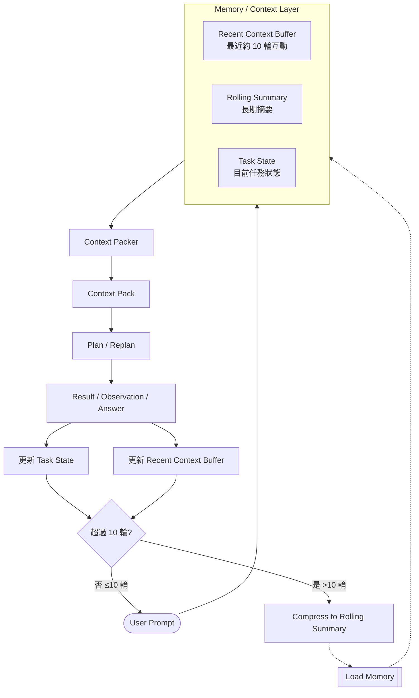
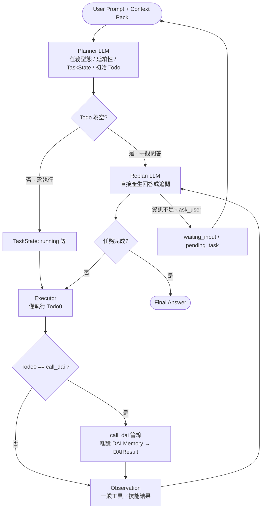
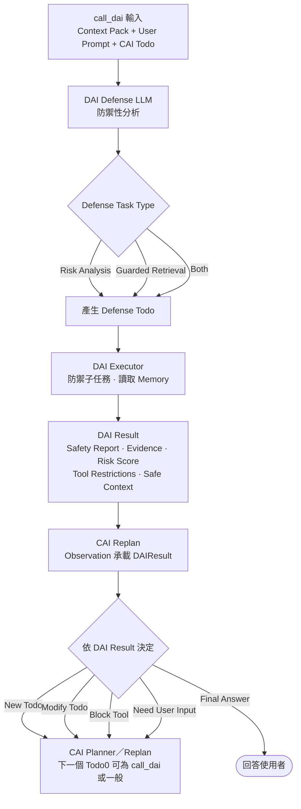
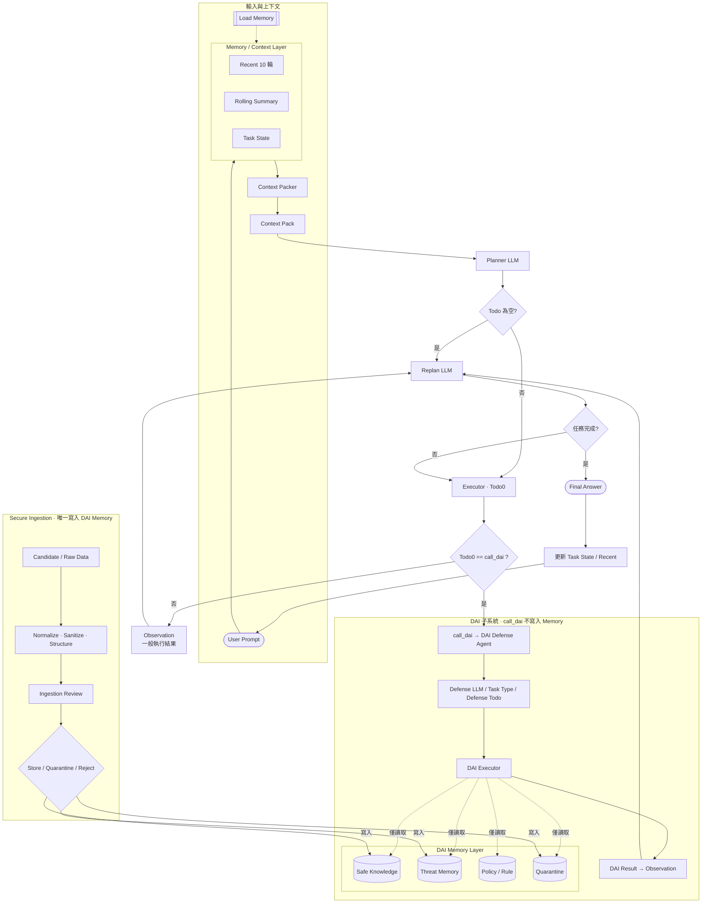
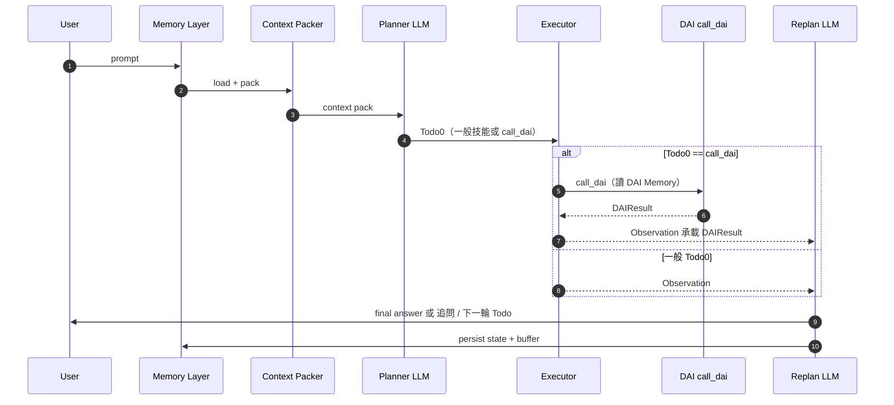

# Dual-Agent 流程圖（Mermaid 合併版）

本文件將視覺稿中的多張流程圖合併為可版本控制的 **Mermaid** 描述，並與 `projrct.md` 的架構邊界對齊。實作時以型別與模組邊界為準；圖表為行為摘要。

---

## 圖例與對齊說明（正式規格語意）

- **Planner / Replan**：可為不同提示詞的同一角色（兩段 LLM），圖中分開標示。
- **DAI 觸發點（唯一）**：凡需要走 DAI，**下一個可執行的 Todo\[0\] 型別即為 `call_dai`**。Executor **不**另做「要不要叫 DAI」的平行判定；是否需 DAI 已反映在佇列裡。
- **非 `call_dai` 的 Todo\[0]**：一律走 **一般 Executor → Observation（執行結果／觀察）→ Replan**。
- **DAI Memory 讀寫**：在 **風險分析**、**Guarded Retrieval** 等 `call_dai` 管線內，對 DAI Memory（含 Safe / Threat / Policy / Quarantine 等）**僅能讀取**，**不**因單次分析／檢索而寫入。
- **寫入 DAI Memory 的唯一管道**：**Secure Ingestion**（正規化 → 消毒／結構化 → Ingestion Review → Store／Quarantine／Reject 後之持久化）。
- **CAI 不得直接存取 DAI 所屬 DB**：僅能透過 **`call_dai`**（與入庫 API，若由受控服務暴露）取得 `DAIResult`／安全上下文；不得繞過 DAI 直寫記憶庫。

---

## 1. Memory／Context Layer（10 輪＋滾動摘要）

---

## 2. CAI 主迴路：Planner → Executor ⇄ Replan（含一般問答捷徑）

---

## 3. DAI 管線（僅當 Todo0 = call_dai 由 Executor 進入）

**Planner／Replan** 負責把「需要 DAI」排成 **`call_dai`** 這個 Todo；本圖從 **call_dai 輸入** 開始，不另畫「要不要 DAI」菱形。此管線對 DAI Memory **只讀**；持久化寫入僅見 **§4 Secure Ingestion**。

---

## 4. 完整端到端：圖 1 + 圖 2 + DAI Memory（讀／寫分離）+ Secure Ingestion

- **call_dai 路徑**：Executor 僅在 **Todo0 = call_dai** 時進入；對 **DAI Memory 僅讀**。
- **Secure Ingestion**：**唯一**對 DAI Memory 做**持久化寫入**的路徑（圖中以 **寫入** 標示）。

---

## 5. 單回合互動（Sequence，摘要）

---

## 6. 與 `projrct.md` 的對照檢查清單

| 項目 | 圖中節點 |
|------|-----------|
| DAI 觸發 | **Todo0 = call_dai**；無 Executor 外重複判定 |
| 非 DAI Todo | 圖 2：`Todo0 != call_dai` → Observation → Replan |
| CAI 不直連 DB | CAI 經 `call_dai`／入庫管線；不直寫 DAI Memory |
| `call_dai` 與 Memory | 圖 4：虛線 **僅讀取** DAI Memory |
| 寫入 Memory | 僅 **Secure Ingestion**（圖 4 實線 **寫入**） |
| Max Replan 迭代 | 圖中未畫計數器；實作須外加上限（見規格） |
| `waiting_input` | 圖 2 `ask_user` 迴圈 |
| Policy／Rule 不依賴純向量 | 圖 4 `Policy / Rule` 與向量庫分離；`call_dai` 可讀取 |

---

## 在本地預覽 Mermaid

- VS Code／Cursor：安裝 **Mermaid** 預覽擴充功能後開啟本檔預覽。
- 或將各段程式碼貼至 [Mermaid Live Editor](https://mermaid.live) 檢查語法。

若你之後調整節點命名或 **Ingestion** 路由（例如 Policy 是否由入庫寫入），建議只改本檔與 `projrct.md` 其中一處為「規格真實來源」，另一處用連結引用，避免雙份漂移。
